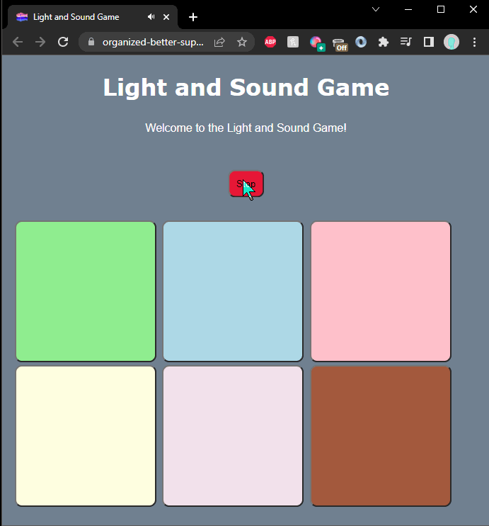

# Pre-work - *Memory Game*

**Memory Game** is a Light & Sound Memory game to apply for CodePath's SITE Program. 

Submitted by: **Jashandeep Singh**

Time spent: **3** hours spent in total

Link to project: https://organized-better-supply.glitch.me (game)
                 https://glitch.com/edit/#!/organized-better-supply (code)

## Required Functionality

The following **required** functionality is complete:

* [x] Game interface has a heading (h1 tag), a line of body text (p tag), and four buttons that match the demo app
* [x] "Start" button toggles between "Start" and "Stop" when clicked. 
* [x] Game buttons each light up and play a sound when clicked. 
* [x] Computer plays back sequence of clues including sound and visual cue for each button
* [x] Play progresses to the next turn (the user gets the next step in the pattern) after a correct guess. 
* [x] User wins the game after guessing a complete pattern
* [x] User loses the game after an incorrect guess

The following **optional** features are implemented:

* [x] Any HTML page elements (including game buttons) has been styled differently than in the tutorial
* [x] Buttons use a pitch (frequency) other than the ones in the tutorial
* [x] More than 4 functional game buttons
* [x] Playback speeds up on each turn
* [x] Computer picks a different pattern each time the game is played
* [x] Player only loses after 3 mistakes (instead of on the first mistake)
* [ ] Game button appearance change goes beyond color (e.g. add an image)
* [ ] Game button sound is more complex than a single tone (e.g. an audio file, a chord, a sequence of multiple tones)
* [ ] User has a limited amount of time to enter their guess on each turn

The following **additional** features are implemented:

- [ ] Centered the game button and text to look more visually appealing

## Video Walkthrough (GIF)

## Reflection Questions
1. If you used any outside resources to help complete your submission (websites, books, people, etc) list them here. 
Stackoverflow

2. What was a challenge you encountered in creating this submission (be specific)? How did you overcome it? (recommended 200 - 400 words) 
  I had some challenges getting the program to use a random pattern everytime the game is played. I over came this by setting the the pattern array length to a constant amount and using a for loop to iterate through the pattern array. Every loop the for loop would set the pattern index to a random whole number from between one and six, this was because I added two more buttons on top of the four originals. A random number was set my using Math.floor and Math.random. Math.floor made the number a whole number by rounding down and Math.random(6) generated a random number from between 0 and 5. To get Math.random to output form one to six i simply added a plus one to the end of the line. 
  Anothing implementation that i had trouble with was the decreasing amount of time the tiles were shown for. I solved this by by making clueHoldTime a var. It was still set to 1000 ms. To decrease the time the tiles were shown in the function playClueSequence in the for loop I set clueHoldTime to clueHoldTime minus nine percent of clue hold time. Making the pattern go faster and faster every turn inturn making the game harder. I choose nine percent because ten percent compound a bit to fast making the game nearly impossible to play after six to seven turns.

3. What questions about web development do you have after completing your submission? (recommended 100 - 300 words) 
  The questions I have for web development are mainly to do with divs. While working on this project I looked more into divs and found out about flex box and grid. Apparently, they are used to format pages for websites. My question is how do they work? Is one better than the other? Will we learn about these topics in detail in the internship? Some additional question I have are what are some common practices used for creating websites and webpages? Are there other technologies that we can use that will speed up the process of coding a website? When learning about css on the project I stumbled upon Sass a technology to make writing css code easier, will we be learning about that? 

4. If you had a few more hours to work on this project, what would you spend them doing (for example: refactoring certain functions, adding additional features, etc). Be specific. (recommended 100 - 300 words) 
If I had a more time to work on this project I would definitely implement the ticking clock. The ticking clock with a limited amount of time to play in tandem with the decreased tile pattern show time will make the game very exciting to play and make it even harder. In addition, to the ticking clock I would also like to make the game look better. I would add details to the background, make the button different shapes and have different colors and patterns. Finally, i would also change the sound patterns of the button presses. 

## Interview Recording URL Link

[My 5-minute Interview Recording] https://www.kapwing.com/videos/62465a0417e7ac010066e9cd

## License

    Copyright [Jashandeep Singh]

    Licensed under the Apache License, Version 2.0 (the "License");
    you may not use this file except in compliance with the License.
    You may obtain a copy of the License at

        http://www.apache.org/licenses/LICENSE-2.0

    Unless required by applicable law or agreed to in writing, software
    distributed under the License is distributed on an "AS IS" BASIS,
    WITHOUT WARRANTIES OR CONDITIONS OF ANY KIND, either express or implied.
    See the License for the specific language governing permissions and
    limitations under the License.
